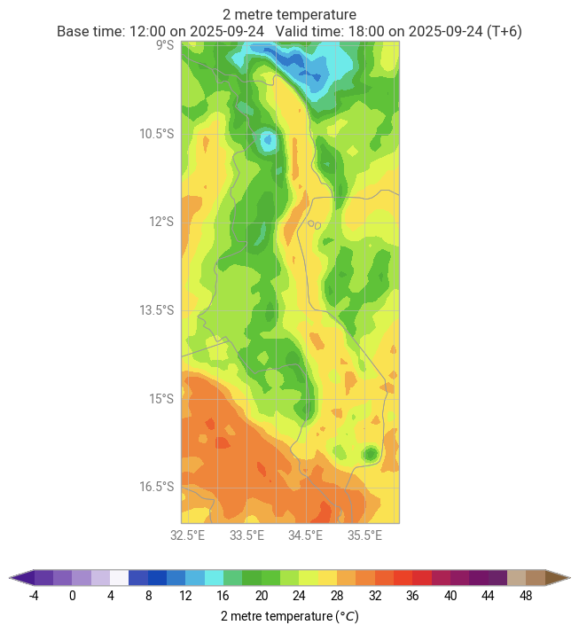

# earthkit-plots-dccms-styles

**DCCMS (Department of Climate Change and Meteorological Services of Malawi) colour schemes and styles for earthkit-plots visualisations.**

This package provides  colour schemes and styling configurations for `earthkit-plots`, following DCCMS visual standards.

## Installation

Install directly from the GitHub repository:

```bash
pip install earthkit-plots-dccms-styles@git+https://github.com/metno/earthkit-plots-dccms-styles
```

## Quick Start

```python
import earthkit.plots as ekp

# Activate DCCMS styling
ekp.schema.use('dccms')

# Your plotting will now automatically use DCCMS styles
chart = ekp.quickplot(data)
```

## Examples

### Basic Usage with Automatic Styling

```python
import earthkit.plots as ekp
import earthkit.data as ekd

# Enable DCCMS schema
ekp.schema.use('dccms')

ds = ekd.from_source("sample", "era5-2t-msl-1985122512.grib")

# Plot data - automatically detects variable and applies appropriate styling
temperature_chart = ekp.quickplot(ds, domain='Malawi')

```

### Customising Plot Appearance

```python
import earthkit.plots as ekp
import earthkit.data as ekd

temperature, pressure = ekd.from_source("sample", "era5-2t-msl-1985122512.grib")

ekp.schema.use('dccms')

# Create a map with custom domain and styling options
chart = ekp.Map(
    domain='Malawi', 
)

chart.quickplot(temperature)
chart.quickplot(pressure, units="hPa")

# Add geographic features
chart.coastlines()
chart.borders()
chart.gridlines()

# Display the plot
chart.show()
```

### Available Weather Variable Styles

The package includes optimised styles for:

- **Temperature**: `near-surface-air-temperature`, `sea-surface-temperature`, `dew-point-temperature`
- **Precipitation**: `total-precipitation`
- **Atmospheric**: `cloud-cover`, `relative-humidity`, `mean-sea-level-pressure`
- **Wind**: `wind-speed-at-10m`, `vertical-velocity-at-100m`

### Example Output

The examples folder contains sample visualisations demonstrating the DCCMS styling:

| File Name         | Description                                | Preview                                   |
|-------------------|--------------------------------------------|-------------------------------------------|
| `2t-Malawi.png`   | Temperature visualisation for Malawi       |  |
| `tp-Africa.png`   | Precipitation map across Africa            |  |
| `tcc-Malawi.png`  | Cloud cover analysis                       |  |
| `r-Africa.png`    | Relative humidity patterns                 |  |
